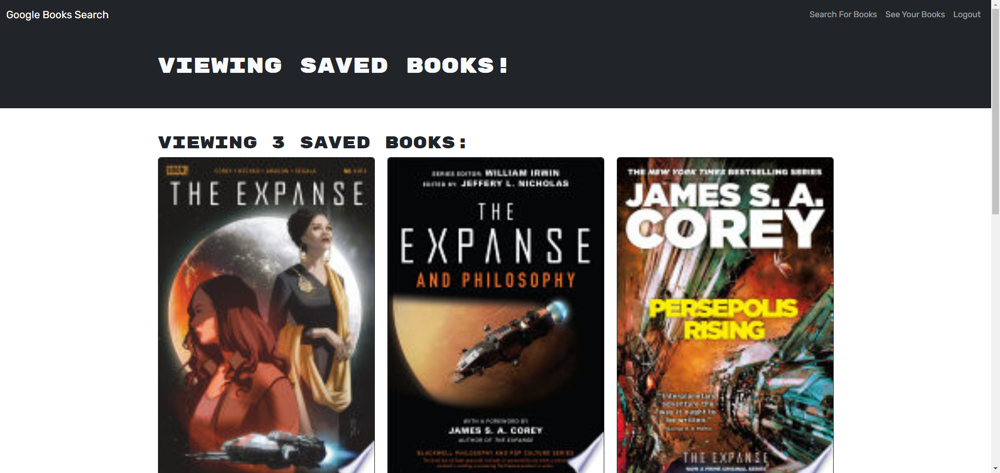

# book-search-engine

## book-search-engine

## Description

This application allows users to search the Google Books API to save searched books to their profile. This leverages React as the front end, JWT for Authentication, MongoDB for database, and NodeJS and GraphQL to serve up the necessary information.

Deployed Application URL: https://blooming-ridge-73147-6ffea772b78e.herokuapp.com/

## Table of Contents

- [Installation](#installation)
- [Usage](#usage)
- [Contribution](#contribution)
- [Tests](#tests)
- [License](#license)
- [Questions](#questions)

## Installation

Run "npm i" from the root folder of the application after cloning, the package.json file already has the necessary dependencies for both client and server using concurrently to ensure all are installed.

## Usage

This application is deployed to Heroku, so your version will need a similar location for deployment. This is also using MongoDB Atlas for the database. Once deployed you can search for books but not save to list, this will require logging in or signing up (using JWT behind the scenes to authenticate). Once logged in a "Save Book" icon will appear underneath your searches, which can be viewed at any time using the "See your Books" link. Books can also be removed from this page.

## Contribution

N/A

## Tests

N/A

## License

MIT License

## Questions

You can reach me at danielwatkins@byu.net or find me at https://github.com/dan-watkins
